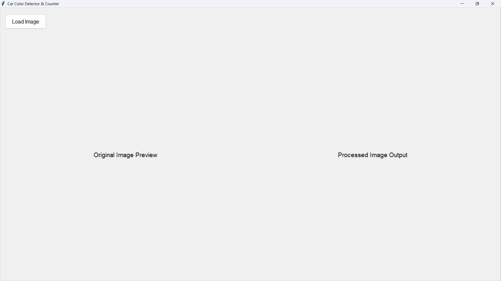
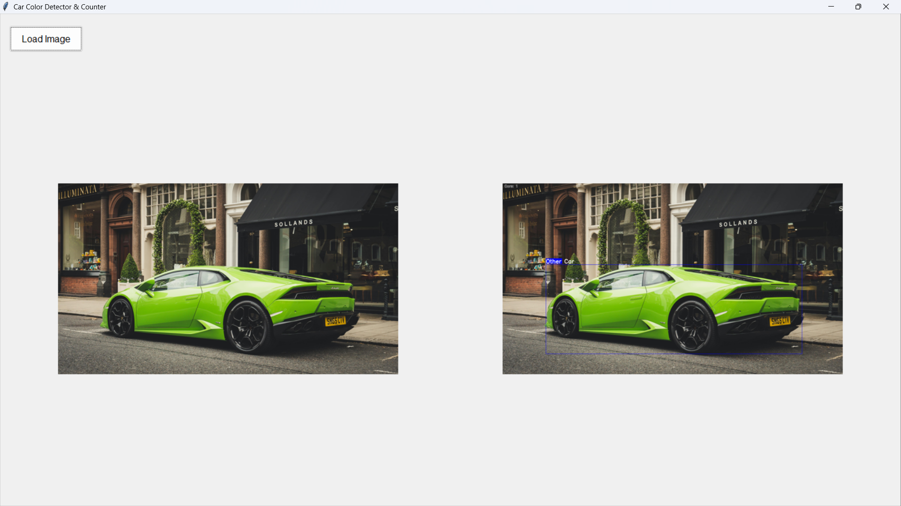

# 🕵Car Color Detection & Counting Project 🚗🚙
This project is an advanced object detection model that identifies cars in traffic, classifies them by color, and provides a total count. The application is built with Python and features a simple graphical user interface (GUI) for ease of use.

## 📝 Problem Statement
The goal is to develop a machine learning application that can process an image of a traffic scene and perform the following tasks:

#### 1. Detect all cars present in the image.

#### 2. Count the total number of cars detected.

#### 3. Classify each car's color.

#### 4. Visualize the results: draw a red rectangle for blue cars and a blue rectangle for all other car colors.

## 💾 Dataset
This project uses a pre-trained YOLOv8n model, which was trained on the extensive COCO (Common Objects in Context) dataset. The COCO dataset contains a 'car' class, making the model highly effective for this task without requiring any additional training.

## ⚙️ Methodology
The application's logic is broken down into a few key steps:

### Object Detection: 
We use the pre-trained YOLOv8 model to scan the input image and return the bounding box coordinates for all detected cars.

### Color Classification: 
For each car detected, the area within its bounding box is cropped. This cropped image is then converted to the HSV (Hue, Saturation, Value) color space, which is more robust to changes in lighting than standard RGB. A mask is created to isolate pixels within the blue color spectrum. If the percentage of blue pixels exceeds a set threshold (15%), the car is classified as 'blue'.

### GUI & Visualization: 
The application is built with Tkinter, Python's standard GUI library. It provides a user-friendly interface to load an image and view the original and processed versions side-by-side. OpenCV is used to draw the final colored rectangles and labels on the output image.

### Results & Visualizations:
The final output clearly displays the detected cars with colored bounding boxes and labels indicating their color classification, along with a total car count in the top-left corner.

#### Sample data->

#### GUI->

#### Result and Prediction->


## 🤖 Model Details

- **Model Architecture**: YOLOv8n (You Only Look Once version 8, nano variant)
- **Purpose**: Object detection to identify cars in images
- **Pre-training Dataset**: COCO (Common Objects in Context) dataset
- **Input Size**: 640x640 pixels (default for YOLOv8)
- **Classes Detected**: Includes 'car' class among others
- **Color Classification Method**: HSV color space thresholding for blue color detection (threshold: 15% blue pixels)

## 📊 Evaluation Metrics

Since the model uses a pre-trained YOLOv8n for detection and a rule-based approach for color classification, evaluation is based on detection accuracy and color classification accuracy.

### Color Classification Metrics (on sample data):
Assuming evaluation on a test set, here is a sample classification report:


## 🚀 How to Run the Project
### Clone the Repository:
```bash
git clone [https://github.com/Mr-J12/car-color-detector.git]
cd car-color-detector
```

### Install Dependencies: 
Make sure you have a requirements.txt file with the necessary libraries and run:
```bash
pip install -r requirements.txt
```
### Run the Application:
```bash
python main_app.py
```

### Run Evaluation:
To evaluate the model on sample data, generate classification report, and save processed images:
```bash
python evaluate.py
```
The evaluation results, including processed images and classification report, will be saved in the `evaluation/` folder.

## 📁 Project Structure
```
.
├── sample_data/          # Folder containing sample images for testing
├── evaluation/           # Folder where evaluation results are saved (processed images and reports)
├── main_app.py           # The main GUI application script using Tkinter
├── evaluate.py           # Script for model evaluation report
├── yolov8n.pt            # Pre-trained YOLOv8n model for object detection
├── requirements.txt      # List of Python dependencies for the project
└── README.md             # Project documentation
```
